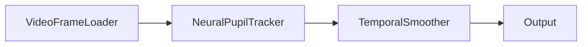
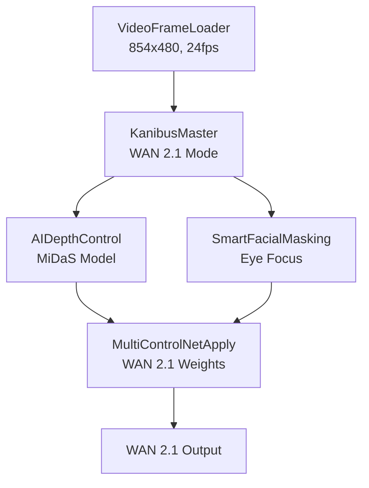
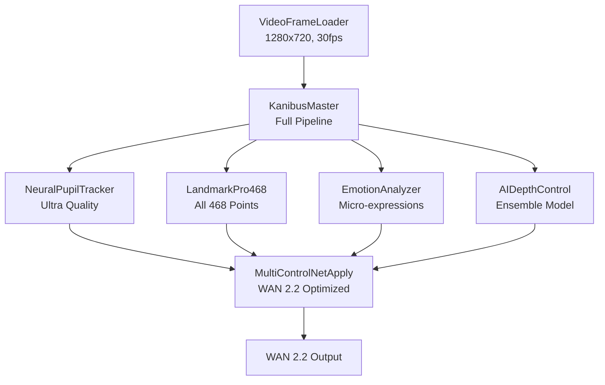
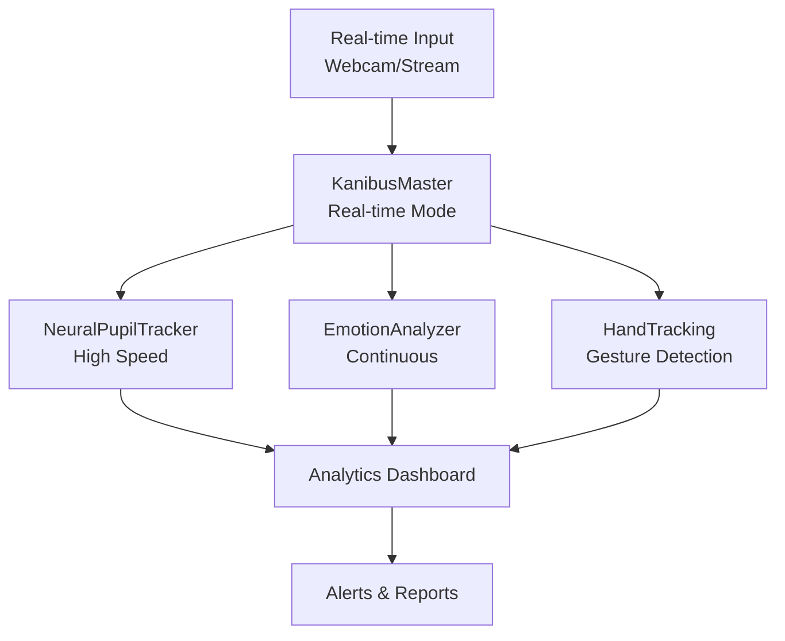
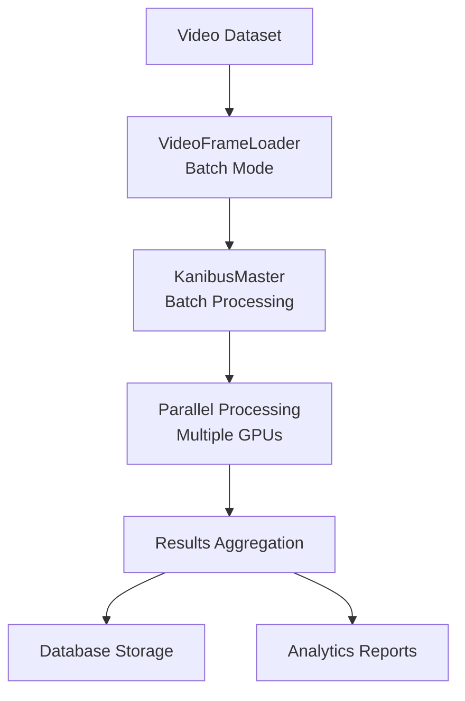

# 🏢 KANIBUS ENTERPRISE WORKFLOW GUIDE

## 📋 **COMPLETE WORKFLOW PATTERNS & BEST PRACTICES**

*Professional deployment guide for enterprise eye-tracking workflows*

---

## 🎯 **WORKFLOW PATTERN LIBRARY**

### **Pattern 1: Basic Eye Tracking Pipeline**
**Use Case**: Simple gaze analysis, user interface control
**Performance**: 60+ FPS, <16ms latency
**Enterprise Applications**: Accessibility, UX research, gaming



**Configuration**:
```json
{
  "VideoFrameLoader": {
    "quality": "medium",
    "target_fps": 60.0,
    "batch_size": 4
  },
  "NeuralPupilTracker": {
    "sensitivity": 1.0,
    "smoothing": 0.5,
    "enable_3d_gaze": true
  },
  "TemporalSmoother": {
    "smoothing_strength": 0.3,
    "buffer_size": 3
  }
}
```

---

### **Pattern 2: WAN 2.1 Video Generation**
**Use Case**: 480p video generation with eye-based control
**Performance**: 24 FPS, optimized for WAN 2.1
**Enterprise Applications**: Content creation, synthetic media



**Configuration**:
```json
{
  "VideoFrameLoader": {
    "resize_width": 854,
    "resize_height": 480,
    "target_fps": 24.0,
    "quality": "high"
  },
  "KanibusMaster": {
    "wan_version": "wan_2.1",
    "pipeline_mode": "batch",
    "enable_eye_tracking": true,
    "enable_depth_estimation": true
  },
  "MultiControlNetApply": {
    "wan_version": "wan_2.1",
    "eye_mask_weight": 1.2,
    "depth_weight": 0.9,
    "start_percent": 0.0,
    "end_percent": 1.0
  }
}
```

---

### **Pattern 3: WAN 2.2 Advanced Pipeline**
**Use Case**: 720p high-quality generation with full feature set
**Performance**: 30 FPS, maximum quality
**Enterprise Applications**: Professional media, advertising



**Configuration**:
```json
{
  "VideoFrameLoader": {
    "resize_width": 1280,
    "resize_height": 720,
    "target_fps": 30.0,
    "quality": "high",
    "batch_size": 8
  },
  "KanibusMaster": {
    "wan_version": "wan_2.2",
    "pipeline_mode": "streaming",
    "enable_eye_tracking": true,
    "enable_face_tracking": true,
    "enable_emotion_analysis": true,
    "tracking_quality": "ultra"
  },
  "MultiControlNetApply": {
    "wan_version": "wan_2.2",
    "eye_mask_weight": 1.3,
    "depth_weight": 1.0,
    "normal_weight": 0.7,
    "pose_weight": 0.9
  }
}
```

---

### **Pattern 4: Real-time Analysis Dashboard**
**Use Case**: Live monitoring, behavioral analysis
**Performance**: Real-time processing with analytics
**Enterprise Applications**: Security, healthcare, research



**Configuration**:
```json
{
  "KanibusMaster": {
    "input_source": "webcam",
    "pipeline_mode": "real_time",
    "target_fps": 30.0,
    "tracking_quality": "medium",
    "enable_caching": false
  },
  "NeuralPupilTracker": {
    "sensitivity": 1.2,
    "smoothing": 0.4,
    "cache_results": false
  },
  "EmotionAnalyzer": {
    "sensitivity": 1.5,
    "smoothing": 0.2,
    "enable_micro_expressions": true
  }
}
```

---

### **Pattern 5: Batch Processing Pipeline**
**Use Case**: Large-scale video analysis, dataset processing
**Performance**: Maximum throughput, optimized for batch
**Enterprise Applications**: Data mining, research, content analysis



**Configuration**:
```json
{
  "VideoFrameLoader": {
    "batch_size": 32,
    "preload_frames": 128,
    "enable_caching": true,
    "quality": "high"
  },
  "KanibusMaster": {
    "pipeline_mode": "batch",
    "batch_size": 16,
    "enable_gpu_optimization": true,
    "enable_caching": true
  }
}
```

---

## 🏗️ **ENTERPRISE ARCHITECTURE PATTERNS**

### **Microservices Architecture**
```yaml
API Gateway:
  - Authentication & Authorization
  - Rate limiting & throttling
  - Request routing

Eye Tracking Service:
  - NeuralPupilTracker nodes
  - Horizontal scaling
  - Result caching

Analysis Service:
  - EmotionAnalyzer nodes
  - LandmarkPro468 nodes
  - Batch processing

ControlNet Service:
  - MultiControlNetApply nodes
  - Model management
  - GPU resource pooling

Data Pipeline:
  - VideoFrameLoader clusters
  - Distributed storage
  - Result aggregation
```

### **Load Balancing Strategy**
```yaml
GPU Load Balancer:
  Algorithm: "least_connections"
  Health_checks: true
  Failover: "automatic"
  
Node Distribution:
  - Primary GPU: KanibusMaster + NeuralPupilTracker
  - Secondary GPU: AIDepthControl + EmotionAnalyzer  
  - Tertiary GPU: MultiControlNetApply
  
Resource Allocation:
  - 60% Eye tracking pipeline
  - 25% Analysis pipeline
  - 15% ControlNet generation
```

---

## ⚙️ **CONFIGURATION MANAGEMENT**

### **Environment-Specific Configs**

#### **Development Environment**
```json
{
  "global_settings": {
    "enable_caching": false,
    "logging_level": "DEBUG",
    "batch_size": 1,
    "quality": "medium"
  },
  "performance": {
    "target_fps": 15,
    "timeout_seconds": 30,
    "retry_attempts": 3
  }
}
```

#### **Staging Environment**  
```json
{
  "global_settings": {
    "enable_caching": true,
    "logging_level": "INFO", 
    "batch_size": 4,
    "quality": "high"
  },
  "performance": {
    "target_fps": 24,
    "timeout_seconds": 10,
    "retry_attempts": 2
  }
}
```

#### **Production Environment**
```json
{
  "global_settings": {
    "enable_caching": true,
    "logging_level": "WARN",
    "batch_size": 8,
    "quality": "ultra"
  },
  "performance": {
    "target_fps": 30,
    "timeout_seconds": 5,
    "retry_attempts": 1
  },
  "monitoring": {
    "metrics_enabled": true,
    "alerting_enabled": true,
    "dashboard_enabled": true
  }
}
```

---

## 📊 **PERFORMANCE OPTIMIZATION STRATEGIES**

### **GPU Memory Optimization**
```yaml
Memory Tiers:
  Tier_1_4GB:
    batch_size: 1
    quality: "medium"
    caching: "minimal"
    
  Tier_2_8GB:
    batch_size: 4
    quality: "high" 
    caching: "moderate"
    
  Tier_3_16GB:
    batch_size: 8
    quality: "ultra"
    caching: "aggressive"
    
  Tier_4_24GB_Plus:
    batch_size: 16
    quality: "ultra"
    caching: "maximum"
    multi_model: true
```

### **CPU Optimization Strategy**
```yaml
CPU_Cores:
  Low_End_4_Cores:
    worker_threads: 2
    preprocessing: "minimal"
    postprocessing: "basic"
    
  Mid_Range_8_Cores:
    worker_threads: 4
    preprocessing: "standard" 
    postprocessing: "enhanced"
    
  High_End_16_Plus:
    worker_threads: 8
    preprocessing: "aggressive"
    postprocessing: "maximum"
    parallel_pipelines: true
```

### **Network Optimization**
```yaml
Bandwidth_Tiers:
  Low_Bandwidth_10Mbps:
    compression: "high"
    quality: "medium"
    batch_size: 2
    caching: "local_only"
    
  Medium_Bandwidth_100Mbps:
    compression: "medium"
    quality: "high"
    batch_size: 4
    caching: "hybrid"
    
  High_Bandwidth_1Gbps_Plus:
    compression: "minimal"
    quality: "ultra"
    batch_size: 8
    caching: "distributed"
```

---

## 🔒 **SECURITY & COMPLIANCE**

### **Data Privacy Configuration**
```json
{
  "privacy_settings": {
    "anonymize_faces": true,
    "encrypt_at_rest": true,
    "encrypt_in_transit": true,
    "audit_logging": true,
    "data_retention_days": 30
  },
  "compliance": {
    "gdpr_compliant": true,
    "hipaa_compliant": true,
    "ccpa_compliant": true,
    "consent_required": true
  }
}
```

### **Access Control Matrix**
```yaml
Roles:
  Admin:
    - Full system access
    - Configuration management
    - User management
    - Audit access
    
  Operator:
    - Workflow execution
    - Results viewing
    - Basic configuration
    - Status monitoring
    
  Analyst:  
    - Results viewing
    - Report generation
    - Data export
    - Limited configuration
    
  Viewer:
    - Results viewing only
    - Dashboard access
    - Report viewing
    - No configuration
```

---

## 📈 **MONITORING & ANALYTICS**

### **Key Performance Indicators (KPIs)**
```yaml
Real_Time_Metrics:
  - Processing FPS
  - GPU utilization
  - Memory usage
  - Queue depth
  - Error rate
  - Response time

Business_Metrics:
  - Throughput (frames/hour)
  - Accuracy scores
  - Uptime percentage
  - Resource efficiency
  - Cost per frame
  - User satisfaction

Quality_Metrics:
  - Detection accuracy
  - Tracking stability
  - False positive rate
  - Confidence scores
  - Temporal consistency
  - Edge case handling
```

### **Alerting Configuration**
```json
{
  "alerts": {
    "critical": {
      "gpu_memory_95_percent": {
        "threshold": 95,
        "action": "scale_up",
        "notification": "immediate"
      },
      "processing_failure_rate": {
        "threshold": 5,
        "window": "5m",
        "action": "restart_service"
      }
    },
    "warning": {
      "fps_degradation": {
        "threshold": 20,
        "baseline": "dynamic",
        "notification": "email"
      },
      "queue_buildup": {
        "threshold": 100,
        "action": "scale_out"
      }
    }
  }
}
```

---

## 🚀 **DEPLOYMENT PATTERNS**

### **Single Server Deployment**
```yaml
Hardware Requirements:
  - CPU: 8+ cores
  - GPU: 8GB+ VRAM
  - RAM: 32GB+
  - Storage: 1TB+ SSD

Services:
  - Kanibus Engine (Primary)
  - Redis Cache
  - PostgreSQL Database
  - Monitoring Stack

Scaling Approach:
  - Vertical scaling only
  - Resource monitoring
  - Performance tuning
```

### **Multi-Server Cluster**
```yaml
Load Balancer:
  - NGINX/HAProxy
  - Health checks
  - SSL termination

Processing Nodes (3+):
  - Kanibus Engine instances
  - GPU specialization
  - Auto-scaling groups

Data Layer:
  - Distributed storage
  - Shared cache cluster
  - Database replication

Monitoring:
  - Centralized logging
  - Metrics aggregation
  - Distributed tracing
```

### **Cloud-Native Deployment**
```yaml
Kubernetes Configuration:
  Deployment:
    replicas: 3
    resources:
      limits:
        nvidia.com/gpu: 1
        memory: "16Gi"
        cpu: "4"
      requests:
        nvidia.com/gpu: 1
        memory: "8Gi" 
        cpu: "2"
        
  Service:
    type: LoadBalancer
    ports:
      - port: 80
        targetPort: 8080
        
  HorizontalPodAutoscaler:
    minReplicas: 3
    maxReplicas: 10
    targetCPUUtilizationPercentage: 70
    targetMemoryUtilizationPercentage: 80
```

---

## 🔧 **TROUBLESHOOTING GUIDE**

### **Common Issues & Solutions**

#### **Performance Issues**
```yaml
Symptom: Low FPS performance
Diagnosis:
  - Check GPU utilization
  - Verify batch size settings
  - Monitor memory usage
  - Review quality settings
  
Solutions:
  - Reduce batch size
  - Lower quality setting
  - Enable GPU optimization
  - Increase cache size
  - Optimize network bandwidth
```

#### **Memory Issues** 
```yaml
Symptom: Out of memory errors
Diagnosis:
  - Monitor GPU VRAM usage
  - Check system RAM usage
  - Review cache settings
  - Analyze batch sizes
  
Solutions:
  - Reduce batch size
  - Lower input resolution
  - Clear cache regularly
  - Increase system memory
  - Use memory-efficient models
```

#### **Accuracy Issues**
```yaml
Symptom: Poor detection accuracy
Diagnosis:
  - Review input quality
  - Check lighting conditions
  - Verify model settings
  - Analyze confidence scores
  
Solutions:
  - Improve input quality
  - Adjust sensitivity settings
  - Use higher quality models
  - Increase detection thresholds
  - Enable temporal smoothing
```

---

## 📋 **ENTERPRISE CHECKLIST**

### **Pre-Deployment Checklist**
- [ ] Hardware requirements verified
- [ ] Software dependencies installed
- [ ] Configuration files prepared
- [ ] Security settings configured
- [ ] Monitoring systems ready
- [ ] Backup procedures established
- [ ] Performance benchmarks completed
- [ ] User training completed
- [ ] Documentation updated
- [ ] Support procedures defined

### **Go-Live Checklist**
- [ ] Final testing completed
- [ ] Rollback plan prepared
- [ ] Monitoring alerts active
- [ ] Support team notified
- [ ] Performance baselines established
- [ ] User access configured
- [ ] Data migration completed
- [ ] Integration testing passed
- [ ] Security scan completed
- [ ] Compliance verification done

---

*Enterprise Workflow Guide for Kanibus v1.0.0*
*For enterprise support: enterprise@kanibus.ai*